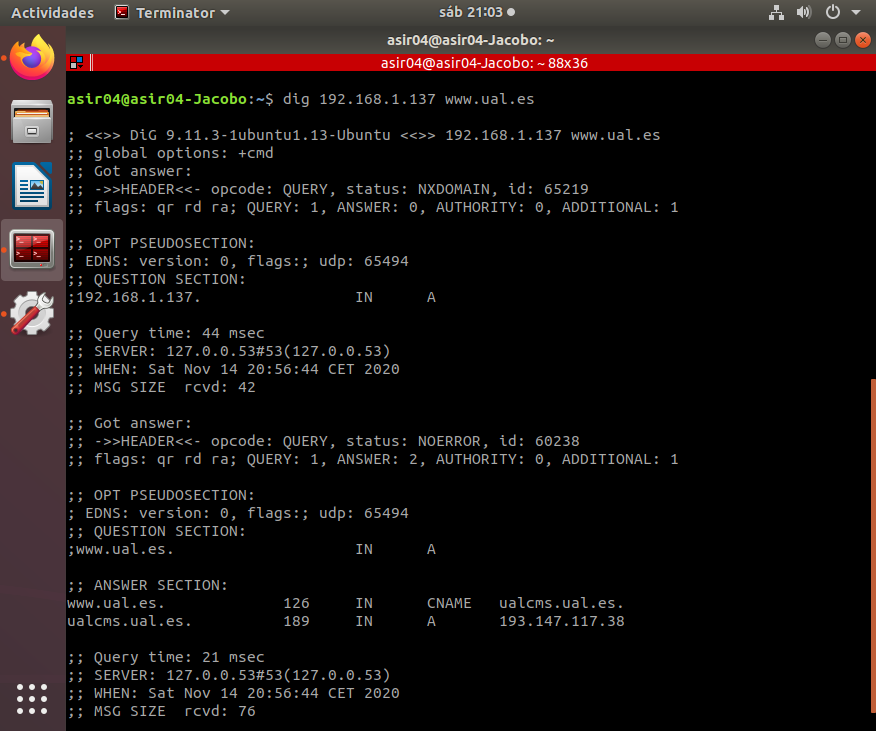
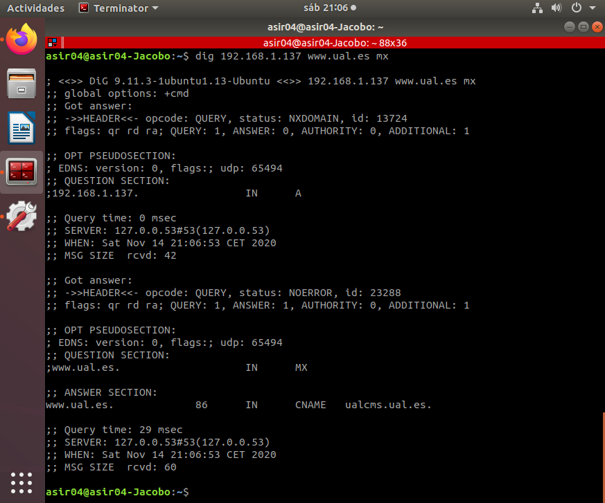

# SRI-PRÁCTICA 02. DNS en Linux (Debian)
> IES Celia Viñas (Almería) - Curso 2020/2021   
> Módulo: SRI - Servicios de Red e Internet   
> Ciclo: CFGS Administración de Sistemas Informáticos en Red 

### Punto 1. CONFIGURACIÓN PREVIA
Siguiendo la configuración de máquinas virtuales que vimos en el tema inicial, vamos aconfigurar un servidor DNS (Bind9) en la máquina de Debian
### Punto 2. INSTALAR SERVICIO
1. Instalar servidor de DNS bind9 en la máquina Debian.a.apt-get updateb.apt-get install bind9
2. Comprueba que el servidor se ha iniciado y que está escuchando en los puertos 53TCP y UDP.

	a. ``ps -ef | grep named``
	b. ``netstat -ltun``


```
Imagen 1.  DNS Ubuntu - Escucha en puerto 53 TCP
```


```
Imagen 2.  DNS Ubuntu - Escucha en puerto 53 UDP
```

3. Configura en el resolv la dirección de la máquina local (127.0.0.1) como servidor DNS.


```
Imagen 3.  DNS Ubuntu - resolv.conf
```
4. Con la orden **dig** y **nslookup** comprueba que se están resolviendo nombres en elservidor.
	a. Si los comandos anteriores no están instalados instala el paquete **dnsutils**.


```
Imagen 4.  DNS Ubuntu - dig 192.168.1.137
```


```
Imagen 5.  DNS Ubuntu - nslookup 192.168.1.137
```

### Punto 3. EJERCICIOS
1. Utilizar el servidor como sólo **caché**. Por defecto, al instalar el servicio DNS, este actúacomo sólo caché, es decir, no es autorizado a ninguna zona y responde a consultas recursivas.

a. Configura el cliente windows y ubuntu con ip fija y que tengan como servidorDNS la dirección del servidor.


```
Imagen 6.  DNS Ubuntu - IP fija y DNS ubuntu cliente
```
b. En windows usa la orden ​nslookup​ y realiza consultas a diversos dominios deinternet ( ​www.google.es​, ​www.mec.es​, ​www.ual.es​ ...).


```
Imagen 7.  DNS Ubuntu - nslookup www.google.es www.mec.es www.ual.es
```
c. En ubuntu y con la orden ​dig​ realiza las siguientes pruebas:

```bash
dig [@servidorDNS] NombreDominioAConsultar [tipoConsulta]
#dig @TuIPServidorDNS www.ual.es (Consulta tipo A: la ip degoogle.es) 
#dig @TuIPServidorDNS www.ual.es a (Consulta tipo A: la ipde google.es) 
#dig @TuIPServidorDNS www.ual.es ns (servidores de DNS degoogle.es)
#dig @TuIPServidorDNS www.ual.es mx (servidores de correo degoogle.es
#dig @TuIPServidorDNS www.ual.es soa (consulta l registro dela zona google.es)
#dig @TuIPServidorDNS www.ual.es any (Todas las consultasa,ns,mx,soa,...)
#dig @TuIPServidorDNS -x 193.147.117.38 (consulta inversa IP--> nombre)
```


```
Imagen 8.  DNS Ubuntu - dig 192.168.1.137 www.ual.es
```


```
Imagen 9.  DNS Ubuntu - dig 192.168.1.137 www.ual.es a
```


```
Imagen 10.  DNS Ubuntu - dig 192.168.1.137 www.ual.es ns
```


```
Imagen 11.  DNS Ubuntu - dig 192.168.1.137 www.ual.es mx
```


```
Imagen 12.  DNS Ubuntu - dig 192.168.1.137 www.ual.es soa
```
d. Edita el fichero de configuración ``named.conf.options`` y configura como reenviador el servidor DNS 1.1.1.1.


```
Imagen 13.  DNS Ubuntu - named.conf.options
```
e. Vuelve a realizar alguna consulta desde Windows con nslookup y captura eltráfico con Wireshark.

2. Crear y configurar el servidor como primario en una zona de resolución directa.

a. Vamos a crear una zona para nuestra red local que se llamará: ​tunombre.sri


```
Imagen 14.  DNS Ubuntu - named.conf.local
```
b. Debemos cambiar el sufijo DNS del equipo a este dominio que vamos a crear (esta opción se cambia donde se cambia el nombre del equipo pulsado el botón ​Más​) 

c. Edita el fichero ​``named.conf.local``​ y declara la zona de búsqueda directa para el dominio anterior. (Donde pone profesor cada uno pondrá su nombre). 

d. Crea el fichero de zona de resolución directa ​db.tunombre.sri ​y añade los registros para configurar el servidor con los valores que se indican (OJO a los puntos finales). Ver ANEXO I 

e. Parte inicial SOA 
 
➢Nombre del servidor principal para que sea ns.tunombre.sri  
➢Contacto: tunombre.tunombre.sri  
➢Serial: 20191112  
➢Refresh: 604800  
➢Retry: 86400  
➢Expire: 2419200  
➢TTL negativo 10800  


```
Imagen 15.  DNS Ubuntu - db.jacobo.sri
```

f. En el registro servidores de nombre (NS) configuramos uno nuevo que seans.tunombre.sri (la propia máquina)
g. Establece los registros de tipo A para las siguientes direcciones:
➢ns.tunombre.sri → la IP del servidor (dos registros, uno por cada IP)  
➢tunombre.sri → la IP de tu máquina anfitriona.  
➢pcXX.tunombre.sri → 192.168.22.X (dónde XX es la IP de uncompañero)  
➢router.tunombre.sri → 192.168.22.100 (Ip del router)  
➢win.tunombre.sri → 10.0.X.X (ip de tu máquina cliente windows)  
➢ubuntu.tunombre.sri → 10.0.X.X (ip de tu máquina cliente ubuntu)
h.Establece los siguientes registros de alias (CNAME): 
➢mail → a la máquina ubuntu  
➢ftp → al router  
➢www → a tunombre.sri (máquina anfitriona)  
➢nombrecompañero → a la máquina del compañero.i.Establece el registro para servidor de correo (MX)  
➢tunombre.sri → mail (ubuntu)  

3. Comprueba el fichero ``named.conf.local`` con el comando ​``named-checkconf``. 


```
Imagen 16.  DNS Ubuntu - named-checkconf
```
4. Comprueba el archivo de zona que has creado con el comando:a.named-checkzone tunombre.sri ``/etc/bind/db.tunombre.sri``. 


```
Imagen 17.  DNS Ubuntu - named-checkzone
```
5. Configurar zonas de resolución inversa para las dos subredes de trabajo y que resuelvacada una de las IP’s establecidas (192.168.22 y 10.0.X). 


```
Imagen 18.  DNS Ubuntu - db.192
```
6. Tienes que crear dos nuevas entradas en el archivo ``named.conf.local``, una por cada red. Ver ANEXO II. 

7. Comprobar en cliente Ubuntu (debe estar configurado con ip fija) el funcionamiento delservidor DNS en el dominio de cada uno tunombre.sri con el comando ​dig​. 

a. Que resuelve todos los nombre y alias. 

b. Que resuelve dominio externos. 

c. Que hace resolución inversa. 


